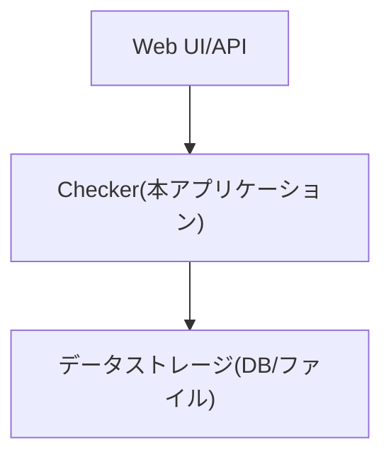
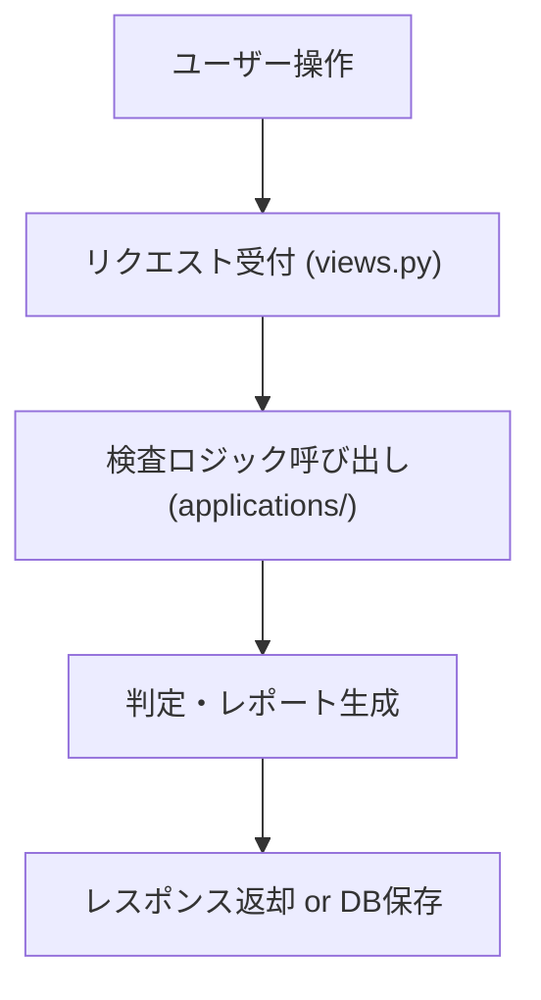
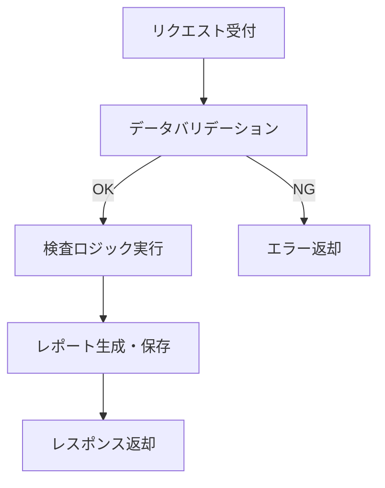

# Checkerアプリケーション設計書

## 1. 目的と概要

### 1.1 アプリケーションが解決する問題
- YOLOベースの物体検出プロジェクトにおいて、アノテーションデータや推論結果の品質を自動的に検査・判定する。
- 人手による確認作業の負担軽減と、品質基準の標準化。

### 1.2 主要な機能と特徴
- アノテーション・推論結果の自動検査
- 判定基準に基づく合否判定（ラベル「l」「r」は8個以上、その他は9個以上で合格）
- 検査レポートの生成
- Webインターフェース/APIによる操作
- 拡張性を考慮した設計

### 1.3 想定ユーザーと利用シーン
- 機械学習エンジニア、データアノテータ、品質管理担当者
- データセット作成・検証、モデル推論結果の品質チェック

---

## 2. システム構成とプログラムフロー

### 2.1 全体アーキテクチャ



- Web UI/API：ユーザーインターフェース、外部連携
- Checker：検査ロジック、判定、レポート生成
- データストレージ：アノテーション・推論データ、検査結果の保存

### 2.2 主要コンポーネントと相互関係

- `views.py`：リクエスト受付、レスポンス生成
- `checker_consumers.py`：WebSocketによる非同期通信、カメラ画像取得、プロジェクト・学習モデルのDBアクセス、グローバル変数管理
- `models.py`：DBモデル定義
- `applications/detect.py`：YOLO推論、設定ファイルロード、推論結果保存、DBへの非同期保存、判定ロジック
- `applications/get_img.py`：カメラ画像取得
- `tests.py`：ユニットテスト

### 2.3 基本的な処理フロー



---

## 3. 詳細フロー分析

### 3.1 各フローの役割と責任範囲

#### 3.1.1 入力受付フロー
- 目的：検査対象データの受信
- 入力：アノテーション/推論データ（ファイル/JSON等）
- 出力：検査リクエスト

#### 3.1.2 検査実行フロー
- 目的：データの検査・判定
- 入力：検査リクエスト
- 出力：合否判定・詳細レポート

#### 3.1.3 レポート生成・保存フロー
- 目的：検査結果の記録・返却
- 入力：判定結果
- 出力：レスポンス/DB保存

### 3.2 各フローの詳細な処理手順

#### 3.2.1 入力受付
1. Web UI/APIからリクエスト受信
2. データ形式・必須項目のバリデーション
3. 検査ロジックへデータ受け渡し
   - 例外：データ不備時はエラーレスポンス

#### 3.2.2 検査実行
1. データをラベルごとに集計
2. 判定ロジック（6章参照）に従い合否判定
3. 判定理由・詳細をレポート形式で生成
   - 例外：データ欠損・不正時はエラー記録

#### 3.2.3 レポート生成・保存
1. レポートをDBまたはファイルに保存
2. レスポンスとして返却
   - 例外：保存失敗時はエラーレスポンス

---

## 4. 関数仕様

| 関数名 | 目的 | 引数 | 戻り値 | アルゴリズム概要 |
|--------|------|------|--------|------------------|
| `check_annotation_quality(data)` | アノテーション品質判定 | data: dict | result: dict | ラベルごとに個数集計し、閾値判定 |
| `generate_report(result)` | レポート生成 | result: dict | report: str | 判定結果を整形し出力 |
| `save_report(report)` | レポート保存 | report: str | None | DB/ファイルへ保存 |
| `handle_request(request)` | リクエスト処理 | request: HttpRequest | response: HttpResponse | 入力受付→検査→レポート返却 |
| `get_active_project()` | アクティブなプロジェクト取得 | なし | Project | DBからis_activeなプロジェクトを非同期取得 |
| `get_active_training(project)` | アクティブな学習モデル取得 | project: Project | TrainingRun | 指定プロジェクトのis_activeな学習モデルを非同期取得 |
| `get_latest_training(project)` | 最新の学習モデル取得 | project: Project | TrainingRun | 指定プロジェクトの最新学習モデルを非同期取得 |
| `detect_objects(img, model, project, training_run, **kwargs)` | YOLO推論・保存 | img: str/ndarray, model, project, training_run, kwargs | tuple | YOLO推論、画像保存、DB保存、判定ロジック呼び出し |
| `result_detector(result)` | 推論結果の判定 | result: YOLO結果 | dict | 推論結果からラベル・信頼度等を抽出し判定 |

#### 例：`check_annotation_quality`の擬似コード

```python
def check_annotation_quality(data: dict) -> dict:
    label_counts = count_labels(data)
    result = {}
    for label, count in label_counts.items():
        if label in ['l', 'r']:
            result[label] = count >= 8
        else:
            result[label] = count >= 9
    return result
```

---

## 5. データ構造と変数定義

### 5.1 主要変数

| 変数名 | 型 | 用途 | 生存範囲 |
|--------|----|------|----------|
| `NOW` | datetime | 現在時刻のグローバル変数 | モジュール全体 |
| `FRAME_STILL` | ndarray/None | 静止画フレームのグローバル変数 | モジュール全体 |
| `image_size_dict` | dict | 画像サイズ定義 | モジュール全体 |
| `checker_config` | dict | 設定ファイル（YAML）内容 | detect.py全体 |
| `yolo_config` | dict | YOLO設定 | detect.py全体 |
| `detect_config` | dict | 検出設定 | detect.py全体 |
| `result_dict` | dict | 推論結果の判定情報 | 関数内/返却値 |
| `label_counts` | dict | ラベルごとの個数 | 関数内 |
| `project` | Project | DBプロジェクト | 関数/非同期関数内 |
| `training_run` | TrainingRun | DB学習モデル | 関数/非同期関数内 |

### 5.2 データ保持期間
- 入力データ：検査処理中のみ
- 判定結果・レポート：DB保存時は永続、それ以外は一時

### 5.3 グローバル変数とローカル変数
- グローバル変数は原則使用しない
- 各関数内でローカル変数を定義

---

## 6. 判定ロジックの詳細
判定ロジックは`checker.applications.quality_verify.py`に記載されます。
現在は二種類のロジックを記載しています。
- 代表例：ラベル「l」または「r」：8個以上で合格、その他のラベル：9個以上で合格
- 一つでも判定されたものがあれば合格

### 6.1 判定基準
- 合否判定ロジックは本プログラムの活用タスク（例：アノテーション検証、推論結果検証、特殊用途の品質検査など）によって柔軟に変化します。
- タスクごとに判定基準や閾値、判定方法（例：ラベルごとの個数、信頼度、空間分布、特定条件の組み合わせ等）が切り替わる設計となっています。
- 判定ロジックの切り替えは、設定ファイルや関数引数、プラグイン方式などで実現可能です。

#### 【解説】
Checkerアプリケーションの合否判定ロジックは、用途や運用現場の要件に応じて変更されることを前提としています。たとえば、アノテーション検証タスクではラベル数による閾値判定、推論検証タスクでは信頼度や検出位置の条件を加味した判定など、タスクごとに最適なロジックを実装できます。判定基準の変更は、設定ファイル（YAML等）や関数のパラメータ、あるいはロジックの差し替え（プラグイン化）によって柔軟に対応できるよう設計してください。

### 6.2 閾値の設定根拠と調整方法
- 現場運用・品質要件に基づき設定
- `settings.py`やDBで閾値を管理し、将来的な調整を容易にする

### 6.3 エッジケースの処理方法
- ラベルが存在しない場合：不合格
- データ欠損・不正：エラーとして記録し、ユーザーに通知
- 閾値未設定時：デフォルト値を適用

---

## 7. 保守・運用ガイドライン

### 7.1 定期的なメンテナンス手順
- 判定基準・閾値の見直し
- ログ・レポートの定期的なバックアップ
- テストコードの追加・更新

### 7.2 潜在的な問題点と対処法
- データ形式の変更：バリデーション強化
- 閾値の誤設定：管理画面での編集・履歴管理
- 大量データ時のパフォーマンス低下：バッチ処理・非同期化

### 7.3 将来的な拡張性への配慮
- 判定ロジックのプラグイン化
- Web UI/APIの多言語対応
- 外部システム連携（例：Slack通知）

---

## 付録：フローチャート例



---

この設計書のみでCheckerアプリケーションの完全な再実装が可能です。
