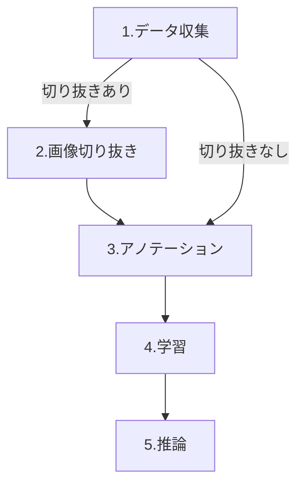
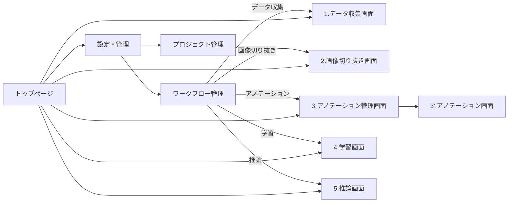

# 全体の流れ
データを収集し、アノテーションを行います。
そのアノテーションをしたデータを使って学習したモデルを使って推論を行います。
画像切り取りを行うかどうかは状況に応じて変えてください。

---

# 本webアプリケーションの画面遷移
基本的に、ワークフロー管理ページをガイドとして、それぞれのアプリケーションを使用していきます。ワークフロー管理ページは強制するものではなく、あくまでガイドとなりますので、たとえ画像切り抜きの工程を飛ばすことは可能です。

---

# 各アプリケーションの使い方
## 設定・管理(configuration)
システム全体の設定やワークフローの管理、プロジェクトの追加・管理を行うためのアプリケーションです。

1. 「設定・管理」画面にアクセスします。
2. 「ワークフロー管理」では、データ処理の流れ（画像切り抜きの有無など）を選択できます。
3. 「プロジェクト管理」では、新しいプロジェクトの作成や既存プロジェクトの確認・削除ができます。
4. 必要に応じて、各種設定（パスや動作モードなど）を変更できます。
5. 設定変更後は、必ず「保存」や「適用」ボタンを押してください。
6. 設定が完了したら、各アプリケーションの画面に移動して作業を進めてください。

---

## データ収集(get_imgs)
カメラや画像ファイルから学習用の画像データを収集します。

1. 「データ収集」画面にアクセスします。
2. 新規プロジェクトを作成するか、既存プロジェクトを選択します。
3. カメラ撮影または画像アップロードでデータを追加します。
4. 必要に応じて、画像の確認や削除を行います。
5. 収集が終わったらワークフロー管理ページに戻ります。

---

## 画像切り抜き(crop_app)
収集した画像から必要な部分だけを切り抜きます（この工程はスキップ可能です）。

1. 「画像切り抜き」画面にアクセスします。
2. プロジェクトを選択し、切り抜きたい画像を選びます。
3. 画像上でマウス操作し、切り抜き範囲を指定します。
4. 「切り抜き」ボタンで画像を保存します。
5. 必要な画像すべてに対して繰り返します。
6. 完了したら「次へ」やワークフロー管理ページに戻ります。

---

## アノテーション(annotator)
画像に対してラベル付け（アノテーション）を行います。

1. 「アノテーション」画面にアクセスします。
2. プロジェクトを選択します。
3. 画像を1枚ずつ表示し、対象物に枠やラベルを付けます。
4. ラベルの追加・編集・削除が可能です。
5. すべての画像にアノテーションが終わったら「次へ」やワークフロー管理ページに戻ります。

---

## 学習(training)
アノテーション済みデータを使ってAIモデルの学習を行います。

1. 「学習」画面にアクセスします。
2. プロジェクトを選択します。
3. 学習パラメータ（エポック数、バッチサイズなど）を設定します。
4. 「学習開始」ボタンを押すと、モデルの学習が始まります。
5. 学習の進捗や結果は画面上で確認できます。
6. 学習が完了したら「次へ」やワークフロー管理ページに戻ります。

---

## 推論(checker)
学習済みモデルを使って新しい画像の推論（判定）を行います。

1. 「推論」画面にアクセスします。
2. プロジェクトと学習済みモデルを選択します。
3. 推論したい画像をアップロードまたはカメラで撮影します。
4. 「推論」ボタンを押すと、結果が画面に表示されます。
5. 必要に応じて他の画像でも繰り返し推論できます。

